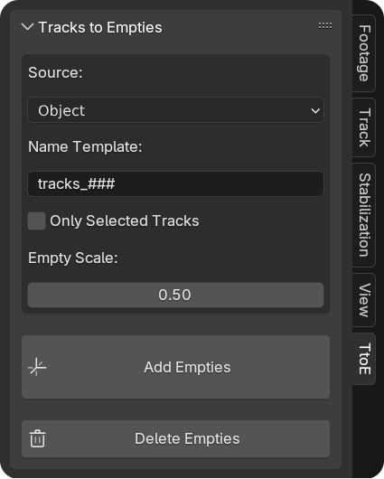
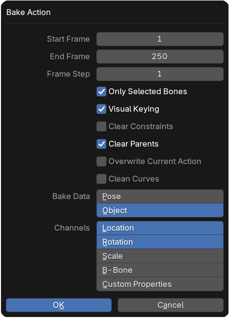
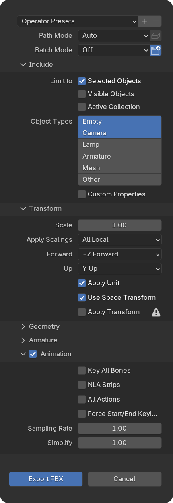

  

<h1 align="center">Track Locators</h1>

Blender add-on to replace reconstructed motion tracks with empties for export to other software.

**Download last release:**

---

## Features

- Replace reconstructed motion tracks with empties

---

## Installation

1. Download the latest release (.zip).

2. In Blender, go to `Edit` → `Preferences` → `Add-ons` → `Install`.

3. Select the downloaded `.zip` file.

4. Enable the add-on in the list.

---

# Usage

- Open Blender and go to the **Movie Clip Editor**.

- In the sidebar ("N" key), find the "TtoE" panel.

- Click "Create emptirs track" to create empty and set it to tracks.****

#№ Exporting Animated Tracks via Track Locators

Follow these steps to export your tracked animation as empties in FBX format:

## 1. Prepare your tracked object  
- In the Track Locators panel, set **Source** to **Object**.  
- Adjust any other settings (name template, scale, etc.) as needed.

  
*Track Locators panel with “Object” source selected.*

## 2. Generate empties  
- Select your tracked object in the 3D view.  
- Click **Add Empties**.  
- Empty objects will be created and parented to your object.

## 3. Bake animation  
- In the Bake menu, enable:  
  - **Visual Keying**  
  - **Clear Parents**  
- Run the bake.  
- Each empty will now have its animation baked and its parent link removed.

  
*Bake settings: Visual Keying & Clear Parents.*

## 4. Export to FBX  
- Go to **File → Export → FBX (.fbx)**.  
- In the **Animation** section, uncheck all four boxes.  
- Click **Export FBX**.

  
*FBX export settings: all Animation checkboxes off.*

## 5. Import into other software  
- Your empties, with baked animation, are now ready for import.  
- (Tested in Maya; compatibility with other packages TBD.)

You’re all set—your motion-tracked animation is exported as animated empties for use in any FBX-compatible software.  

---
## License

This project is licensed under the [GPL-3.0 License](https://www.gnu.org/licenses/gpl-3.0.en.html).
